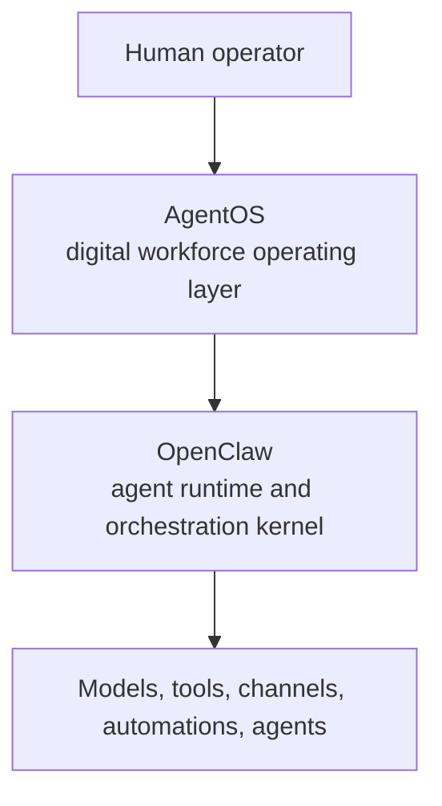
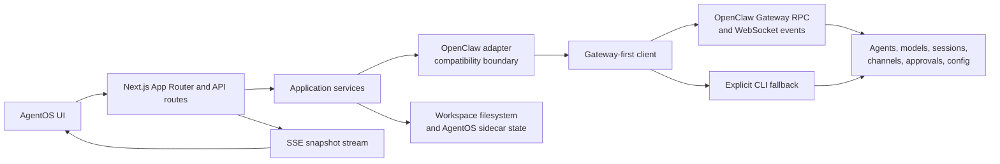

<div align="center">
  

<h1 style="font-size:3.75rem; line-height:0.95; margin:0 0 0.25rem;">
  <strong>Agent<span style="color:#d7263d;">OS</span></strong>
</h1>

<p style="font-size:1.45rem; line-height:1.15; margin:0 0 0.35rem;"><strong>Build your AI workforce.</strong></p>
<p style="font-size:1.15rem; line-height:1.15; margin:0 0 0.85rem;"><strong>Run it like a company.</strong></p>

<p>
  AgentOS is an open-source operating layer for building and running teams of digital workers.
  Create workspaces, give workers context and tools, assign real work, inspect execution, and scale autonomy with human oversight.
</p>

<p>
  Powered by <a href="https://github.com/openclaw/openclaw"><strong>OpenClaw</strong></a> as the agent runtime.
  AgentOS turns its underlying capabilities into a coherent system for people operating AI teams.
</p>

<p>
  <a href="https://agentos.sapienx.app/"><strong>Website</strong></a>
  ·
  <a href="https://youtu.be/ribFHZuKRos"><strong>Watch Demo</strong></a>
  ·
  <a href="#get-started-in-5-minutes"><strong>Get Started</strong></a>
  ·
  <a href="#what-agentos-does"><strong>Features</strong></a>
  ·
  <a href="#how-it-works"><strong>Architecture</strong></a>
  ·
  <a href="#development"><strong>Development</strong></a>
</p>

<p align="center">
  <a href="https://nextjs.org" target="_blank" rel="noreferrer" title="Next.js">
    
  </a>
  &nbsp;
  <a href="https://react.dev" target="_blank" rel="noreferrer" title="React">
    
  </a>
  &nbsp;
  <a href="https://www.typescriptlang.org" target="_blank" rel="noreferrer" title="TypeScript">
    
  </a>
  &nbsp;
  <a href="https://github.com/openclaw/openclaw" target="_blank" rel="noreferrer" title="OpenClaw">
    
  </a>
  &nbsp;
  <a href="https://pnpm.io" target="_blank" rel="noreferrer" title="pnpm">
    
  </a>
</p>

</div>

## The operating layer for digital workers

Running one AI agent is easy.

Running many agents across real projects, accounts, models, schedules, files, and approval boundaries is an operating problem.

AgentOS gives a human operator one place to:

- create and organize digital workers;
- give each worker identity, context, memory, policies, tools, and model access;
- assign immediate, scheduled, recurring, or one-off work;
- inspect live activity, transcripts, outputs, token usage, and created files;
- connect workspaces to channels and browser-based accounts;
- review system health, capabilities, fallbacks, and failures;
- keep humans in control of sensitive actions.

The goal is not another chat interface. It is a practical operating system for AI-native work.

## Why AgentOS

AI agents are becoming cheaper, more capable, and more persistent. The next bottleneck is no longer generating a response. It is designing and operating the organization around them.

Digital workers need more than prompts:

- **Structure** — clear workspaces, roles, goals, and ownership.
- **Context** — project files, memory, policies, accounts, and operating instructions.
- **Execution** — models, tools, channels, automations, and real runtime access.
- **Coordination** — tasks, handoffs, schedules, shared visibility, and recoverable state.
- **Control** — approvals, diagnostics, auditability, and human intervention.

AgentOS is being built for that layer: the place where a person can turn individual agents into a functioning digital team.

## Product tour

<table>
  <tr>
    <td valign="top" width="50%">
      
      <strong>Launchpad</strong><br />
      Prepare OpenClaw, connect a model, and create the first workspace without starting from a blank terminal.
    </td>
    <td valign="top" width="50%">
      
      <strong>Workforce overview</strong><br />
      See workspaces, workers, tasks, runtimes, and health from one operator surface.
    </td>
  </tr>
  <tr>
    <td valign="top" width="50%">
      
      <strong>Digital worker builder</strong><br />
      Create workers from presets or from scratch, then define identity, policies, model, heartbeat, and access.
    </td>
    <td valign="top" width="50%">
      
      <strong>Direct worker conversations</strong><br />
      Guide a worker, request status, resolve blockers, and turn intent into action.
    </td>
  </tr>
  <tr>
    <td valign="top" width="50%">
      
      <strong>Models and providers</strong><br />
      Connect providers, discover available models, and verify readiness from the same interface.
    </td>
    <td valign="top" width="50%">
      
      <strong>Workspace design</strong><br />
      Turn a business or project idea into a structured workspace, team, operating plan, and first missions.
    </td>
  </tr>
  <tr>
    <td colspan="2" valign="top">
      
      <strong>Connected work surfaces</strong><br />
      Bring channels, integrations, accounts, and automations into the workspace where the team operates.
    </td>
  </tr>
</table>

## Get started in 5 minutes

### Deploy on Railway

[](https://railway.com/new/template/agentos-1?utm_medium=integration&utm_source=button&utm_campaign=agentos)

AgentOS includes a production-oriented Railway deployment path that runs AgentOS and the pinned OpenClaw Gateway in the public application service and runs interactive Chromium in a separate private `browser-worker` service. The deployment provisions one persistent `/data` volume for AgentOS/OpenClaw state and a second dedicated `/data` volume for Chromium profiles, keeps the Gateway on container loopback, initializes Instance Protection from the username and password supplied during deployment, and waits for the private worker and Gateway before passing Railway's healthcheck. The Railway external supervisor owns the Gateway process lifecycle; AgentOS configures and observes OpenClaw through its native Gateway and can request a supervised Gateway restart through the lifecycle API without opening a host terminal.

The official published Railway template provisions both required volumes, generates the internal AgentOS, OpenClaw, and browser-worker secrets automatically, and wires the private worker URL through Railway private networking. The only required operator input is the initial administrator password. See [`docs/deploy-on-railway.md`](docs/deploy-on-railway.md) for the complete runtime, private-networking, and template update model.

After the first deployment:

1. Open the generated Railway domain and sign in with the initial admin credentials.
2. Connect a model/provider from AgentOS Setup Center.
3. Create the first workspace. AgentOS and OpenClaw state will persist across redeploys.

The initial password only creates the account when no Instance Protection state exists. Changing that Railway variable later does not reset or replace the administrator account; use AgentOS account settings to change credentials. After the first successful sign-in, you may remove `AGENTOS_INITIAL_ADMIN_PASSWORD` from Railway because the protected account is already stored on the volume.

### Install

macOS or Linux:

```bash
curl -fsSL https://raw.githubusercontent.com/SapienXai/AgentOS/main/install.sh | bash
```

Windows PowerShell:

```powershell
iwr https://raw.githubusercontent.com/SapienXai/AgentOS/main/install.ps1 | iex
```

Or install with a package manager:

```bash
pnpm add -g @sapienx/agentos
# or
npm install -g @sapienx/agentos
```

Install a specific published version:

macOS or Linux:

```bash
curl -fsSL https://raw.githubusercontent.com/SapienXai/AgentOS/main/install.sh | AGENTOS_VERSION=0.7.7 bash
```

Windows PowerShell:

```powershell
$env:AGENTOS_VERSION='0.7.7'; iwr https://raw.githubusercontent.com/SapienXai/AgentOS/main/install.ps1 | iex
```

### Start AgentOS

```bash
agentos start --open
```

Verify the local environment:

```bash
agentos status
agentos doctor --deep
```

Then:

1. complete OpenClaw and model onboarding;
2. create or select a workspace;
3. create a digital worker;
4. assign a mission or scheduled task;
5. inspect the runtime, transcript, and output.

If OpenClaw is already installed, AgentOS connects to the live Gateway and projects its real state. If OpenClaw is missing or unhealthy, AgentOS shows an explicit setup or unavailable state instead of presenting fake operational data.

## What AgentOS does

### Build digital workers

- Create and edit workers with role presets such as `worker`, `setup`, `browser`, `monitoring`, and `custom`.
- Configure identity, model, heartbeat, file access, install scope, network policy, and operating instructions.
- Maintain workspace context through `AGENTS.md`, `SOUL.md`, `IDENTITY.md`, `USER.md`, `TOOLS.md`, `HEARTBEAT.md`, `MEMORY.md`, `docs/`, `memory/`, `deliverables/`, and `skills/`.
- Start from presets, import existing setups, or build a worker from scratch.

### Organize real work

- Create project-backed workspaces instead of disposable chat threads.
- Dispatch missions to real OpenClaw agents.
- Create work that runs now, on a cron schedule, at an interval, or once at a future time.
- Inspect task history, retries, runtime state, transcripts, final output, warnings, token usage, and created files.
- Use the guided planner to move from company and product context to a deployed workspace, team, automations, channels, and first missions.

### Connect the workforce

- Discover and configure local or remote models through supported providers.
- Connect workspace surfaces such as Telegram, Discord, and Slack where supported by OpenClaw.
- Work with OpenClaw browser profiles and account targets through AgentOS access rules.
- Configure the Gateway endpoint and default workspace root.
- Accounts and browser profiles are an MVP bridge. OpenClaw does not yet expose typed browser-profile dispatch.
- Use native Gateway capabilities first; CLI fallback remains explicit and visible only where required.

### Operate with control

- Inspect Gateway health, protocol compatibility, auth state, scopes, models, sessions, channels, skills, approvals, and supported methods.
- Review native versus fallback execution instead of hiding degraded paths.
- Apply Gateway config changes with concurrency protection and secret redaction.
- Surface repair is preview-first.
- Use update preflight, compatibility decisions, postflight checks, and rollback metadata for safer OpenClaw updates.
- `requires_approval` account access rules are intentionally blocked until approval dispatch exists.
- Keep risky or unsupported actions blocked rather than pretending they are available.

## How it works



### Responsibilities

| Layer | Responsibility |
| --- | --- |
| Human operator | Sets direction, reviews work, approves sensitive actions, and steers the organization |
| AgentOS | Organizes workers and workspaces, presents live state, dispatches work, and provides control and diagnostics |
| OpenClaw | Owns the Gateway, agent runtime, models, sessions, channels, automations, and execution primitives |
| Models and tools | Perform reasoning and tool-backed work |

### Runtime architecture



AgentOS does not replace OpenClaw. OpenClaw is the kernel; AgentOS is the human operating layer above it.

OpenClaw remains the source of truth for Gateway state and execution. AgentOS reads that state, normalizes it into an operator-facing snapshot, and translates UI actions into native Gateway calls, documented CLI fallbacks, or real filesystem changes.

## Operations and scheduled work

The Operations surface projects OpenClaw's cron runtime into an operator console.

- OpenClaw remains the source of truth for job definitions, execution, retries, run history, sessions, and restart recovery.
- AgentOS stores only bounded operator metadata, safety decisions, and audit information under `.mission-control/operations/`.
- Native cron methods are used only when the Gateway advertises them.
- Planner automations and Operations share the same OpenClaw scheduler; AgentOS does not introduce a second hidden scheduler.
- Unsupported controls, including capabilities not exposed by the current OpenClaw RPC, remain visibly unavailable.

## Local-first security

AgentOS supports trusted operator machines and an explicitly configured hosted deployment.

- The packaged launcher binds locally, generates an API token, starts AgentOS with authentication, and opens an authenticated local URL.
- API routes are protected before route handlers run.
- Remote write access remains disabled by default. Operators may opt in exact HTTPS origins with `AGENTOS_TRUSTED_OPERATOR_ORIGINS`; authenticated AgentOS access remains required.
- Remote Gateway URLs are blocked by default unless `AGENTOS_ALLOW_REMOTE_GATEWAY_URL=1` is explicitly enabled.
- Sensitive values are redacted from diagnostics and compatibility reports.
- Local auth and config files use owner-only permissions where applicable.
- Source and package installs should not be exposed publicly without an external network boundary, access policy, and monitoring. The Railway deployment uses Instance Protection, exact same-origin mutation checks, generated internal tokens, and a loopback-only OpenClaw Gateway as its minimum hosted boundary.

For a custom intentionally remote operator deployment, configure a strong API token and an exact, comma-separated HTTPS origin allowlist:

```bash
AGENTOS_API_TOKEN=<secret>
AGENTOS_TRUSTED_OPERATOR_ORIGINS=https://agentos.example.com
```

Wildcards, HTTP origins, paths, query strings, and fragments are rejected. Keep AgentOS behind HTTPS and an authenticated reverse proxy, and preserve the public `Host`, `Origin`, `X-Forwarded-Host`, and `X-Forwarded-Proto` values. Origin allowlisting is an additional mutation boundary, not a substitute for authentication. Railway's generated `RAILWAY_PUBLIC_DOMAIN` is accepted automatically as one exact HTTPS operator origin; custom domains must still be listed explicitly.

When Instance Protection is enabled, each trusted browser or mobile device can sign in with the configured username and password. The signed Instance Protection session authenticates subsequent API requests, so new devices do not need an `#agentos_token` bootstrap URL. The API token remains required while Instance Protection is disabled and for initial protected-instance setup.

Several operations spawn local processes, inspect transcript files, or write to workspace directories. This makes the current release suitable for operator workstations and persistent trusted hosts, including the documented Railway container, but not serverless-only deployment. Desktop-only actions such as revealing a host file in Finder do not become remote desktop features on Railway.

## Compatibility

The current `0.7.7` package uses OpenClaw `2026.8.1` as its supported baseline:

- Node.js 24 or newer;
- OpenClaw 2026.8.1 or newer;
- a reachable Gateway with valid local authentication;
- at least one ready model for real mission execution.

`agentos doctor --deep` is the release-readiness diagnostic. Run it before assigning real work:

```bash
agentos doctor --deep
```

Useful contributor checks:

```bash
pnpm openclaw:compat
AGENTOS_RUNTIME_SMOKE=1 pnpm smoke:runtime-golden
```

The runtime golden-path smoke dispatches real OpenClaw work. Run it only on a trusted operator machine with Gateway authentication, scopes, model credentials, and writable runtime state ready.

### Safe OpenClaw updates

AgentOS does not assume that the newest detected OpenClaw build is automatically safe.

The Update Center classifies versions as:

- `certified` — allowed through the normal update path after preflight;
- `candidate` — visible with explicit operator opt-in;
- `unknown` — available only through advanced risk acceptance;
- `blocked` — disabled with a compatibility reason or required AgentOS upgrade.

Preflight checks version requirements, Gateway reachability, protocol compatibility, native method coverage, fallback surfaces, config support, model readiness, pending scope issues, and rollback metadata before mutation.

## Current status

AgentOS already supports:

- guided OpenClaw and model onboarding;
- workspace creation and project scaffolding;
- worker creation, editing, presets, and policies;
- Gateway-first mission dispatch;
- direct worker chat;
- runtime, transcript, task, and file inspection;
- live Gateway event projection where supported;
- scheduled and recurring operations;
- diagnostics, capability visibility, auth recovery, reset, and update flows;
- accounts and browser-profile access rules with clearly surfaced runtime limitations;
- packaged installation for macOS, Linux, and Windows.

Some boundaries remain intentionally explicit:

- account-target browser dispatch is an MVP bridge until OpenClaw exposes typed browser-profile dispatch;
- `requires_approval` account tasks stay blocked until approval dispatch is available;
- some recovery and unsupported operations still require visible CLI fallback;
- remote and multi-host management is not yet the primary deployment model.

## Development

### Prerequisites

- Node.js 24 or newer
- `pnpm`
- OpenClaw installed locally and available on `PATH`

For a non-standard OpenClaw installation:

```bash
export OPENCLAW_BIN=/absolute/path/to/openclaw
```

### Run locally

```bash
pnpm install
pnpm dev
```

Open the URL printed by Next.js, usually `http://localhost:3000`.

### Quality checks

```bash
pnpm lint
pnpm typegen
pnpm typecheck
pnpm test
pnpm build
pnpm check:release
pnpm smoke:agentos-package
```

For a real local release rehearsal, follow [`docs/agentos-clean-install-smoke-checklist.md`](docs/agentos-clean-install-smoke-checklist.md).

### Package and release

`packages/agentos/package.json` is the published CLI version source.

```bash
pnpm check:release
pnpm smoke:agentos-package
git tag agentos-v0.7.7
git push origin agentos-v0.7.7
```

The release workflow builds and smoke-tests packages for:

- macOS Apple Silicon;
- macOS Intel;
- Linux x64;
- Windows x64.

## Repository map

```text
app/                         Next.js routes and API surfaces
components/mission-control/  Main operator interface
components/operations/       Workers, jobs, models, and operational views
hooks/                       Client data and workflow hooks
lib/agentos/                 AgentOS application, policy, and integration layers
lib/openclaw/                Gateway client, adapters, compatibility, domains, and state
packages/agentos/            CLI launcher and distributable package
scripts/                     Compatibility, browser, package, and runtime smoke checks
tests/                       Unit, integration, compatibility, and security tests
docs/                        Architecture, migration, release, and operational documentation
```

Some internal files still use the legacy `mission-control` name.

## Roadmap

The direction is larger than managing isolated agents. AgentOS is moving toward persistent digital organizations that can operate continuously while remaining understandable and controllable by people.

Current priorities include:

- stronger worker-to-worker coordination and handoffs;
- durable approval history and audit trails;
- richer recurring workflows and operational recovery;
- multi-user identity, permissions, and workspace isolation;
- remote and multi-host OpenClaw management;
- deeper channel, integration, and account execution;
- long-term worker memory, performance, cost, and reliability analytics;
- company-level views above individual workspaces.

## Contributing

Contributions are welcome.

Please keep changes aligned with the core principles:

- build real OpenClaw-backed behavior instead of front-end-only simulations;
- make degraded or unsupported states explicit;
- protect local credentials, files, and operator control;
- keep compatibility boundaries stable as OpenClaw evolves;
- use concise English copy and commit messages;
- run the relevant quality checks before opening a pull request.

Open an issue for design discussions or submit a pull request for focused improvements.

## License

MIT
